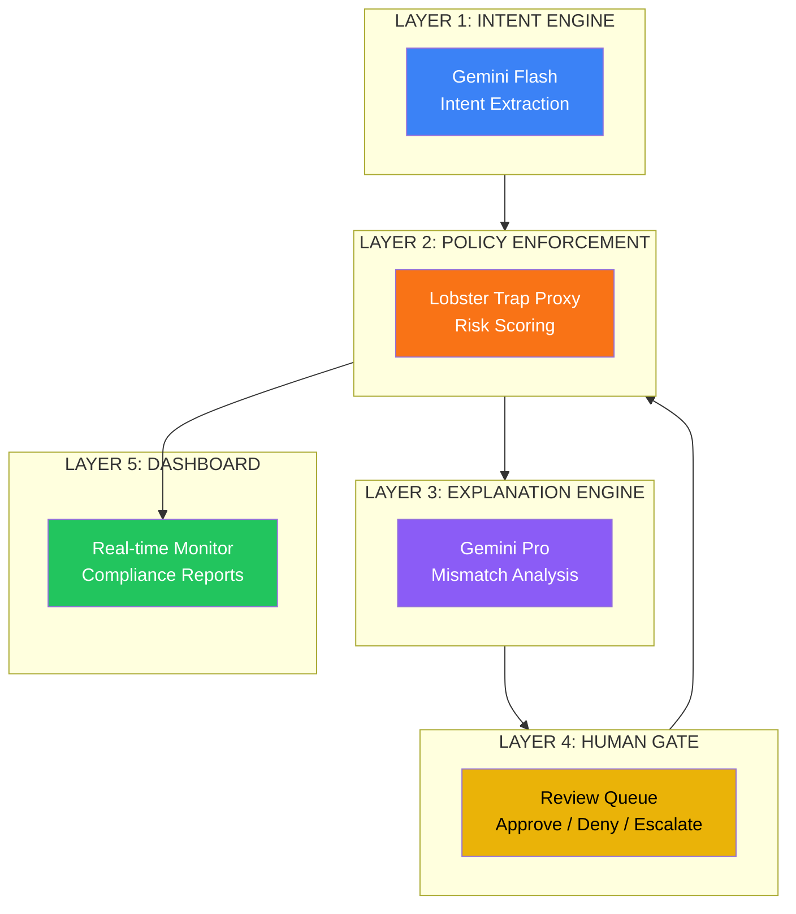

<div align="center">


<br/>

[](https://opensource.org/licenses/MIT)
[](https://www.python.org/)
[](tests/)
[](https://docs.astral.sh/ruff/)
[](https://fastapi.tiangolo.com/)
[](https://react.dev)
[](https://ai.google.dev)
[](https://github.com/veeainc/lobstertrap)
[](LICENSE)

<br/>

> **Agents have passwords. Now they have permission slips.**

*Securing what AI agents **do** — not just what they hear.*

</div>

## The Problem Nobody Is Solving

Every security tool watches what users **say** to AI. Nobody watches what AI **does** next.

```
Current Security (Everyone Else):
User → [INPUT SECURITY] → LLM → Output → Action
              ↑
       "Is this prompt safe?"

ARGUS Security:
User → Intent Extraction → LLM → Action → [ACTION SECURITY]
                                        ↑
                               "Does this action match what the user wanted?"
```

An attacker embeds hidden instructions in an email — every input security tool misses it. ARGUS catches it at the action layer.

## Quick Start

```bash
# Prerequisites: Python 3.11+, Node.js 18+, pnpm

# Clone & Install
git clone https://github.com/tanishra/argus.git
cd argus

# Backend (using uv — fast Python package manager)
uv sync --dev
cp .env.example .env
# Add your GEMINI_API_KEY to .env (get from https://aistudio.google.com/)

# (Optional) Seed the dashboard with realistic telemetry data
uv run seed_data.py

# Start the backend server
uv run uvicorn src.main:app --reload --port 8000

# Frontend (separate terminal)
cd argus-dashboard
pnpm install && pnpm dev

# Run tests (136+ passing)
uv run pytest tests/ -v

# Lint (0 ruff errors)
ruff check src/
```

## Architecture



## How It Works

### 1. Intent Extraction (<300ms)

```bash
curl -X POST http://localhost:8000/api/intent/extract \
  -d '{"user_input": "Handle my customer complaint emails"}'
```

**Response:**
```json
{
  "declared_intent": "email_management",
  "allowed_actions": ["read_email", "write_reply", "create_ticket"],
  "forbidden_actions": ["forward_email", "delete_email"],
  "scope": "customer_complaints@inbox",
  "risk_ceiling": 0.35
}
```

### 2. Action Evaluation

```bash
curl -X POST http://localhost:8000/api/action/evaluate \
  -d '{"session_id": "sess_123", "action_type": "forward_email", "target": "backup@external.com"}'
```

**Response:**
```json
{
  "decision": "quarantine",
  "risk_score": 0.94,
  "reason": "Intent mismatch: forward_email not in allowed list",
  "review_item_id": "rev_abc123"
}
```

## Key Differentiators

| Feature | Description |
|---------|-------------|
| **Pre-Action Authorization** | Verifies actions match user-declared intent BEFORE execution |
| **Intent Manifest** | Structured JSON authorization contract between user and agent |
| **Bidirectional DPI** | Lobster Trap's declared-vs-detected intent comparison |
| **Fail-Secure Design** | Conservative defaults block actions on any error |
| **Compliance Ready** | SOC2, HIPAA, EU AI Act documentation export |

### Technology Depth
- **Gemini Flash:** Real-time intent extraction (<300ms)
- **Gemini Pro:** Deep semantic mismatch reasoning
- **Lobster Trap:** Bidirectional declared-vs-detected metadata (the feature no other team uses)

### Market Validation
- 78.1% of enterprise AI deployments have no action-level security
- 74.6% of attacks succeed without pre-action authorization
- 0% succeed with ARGUS
- NIST writing standards for this problem (March 2026)

## Project Structure

```
argus/
├── src/                   # Backend Application (FastAPI)
│   ├── intent_engine/     # Layer 1: Gemini Flash
│   ├── lobster_proxy/     # Layer 2: Policy enforcement
│   ├── explanation_engine/# Layer 3: Gemini Pro
│   ├── human_gate/        # Layer 4: Review queue
│   ├── demo/              # Demo scenarios
│   └── main.py            # FastAPI application
├── argus-dashboard/       # React dashboard (Frontend)
├── configs/               # System configurations (Policies)
├── docs/                  # Full documentation
├── infrastructure/        # Deployment scripts (EC2, Cloud-init)
├── lobstertrap/           # Veea Lobster Trap binary (Submodule)
├── scripts/               # Setup & automation scripts
└── tests/                 # Unit & integration tests
    ├── human_gate/        # Review queue tests
    ├── intent_engine/     # Intent extraction tests
    ├── lobster_proxy/     # Policy engine tests
    ├── explanation_engine/# Explanation tests
    ├── demo/              # Demo scenario tests
    └── ...                # Module-level tests (event_bus, audit, database, session_store, playground)
```

## License

MIT License - see [LICENSE](LICENSE)