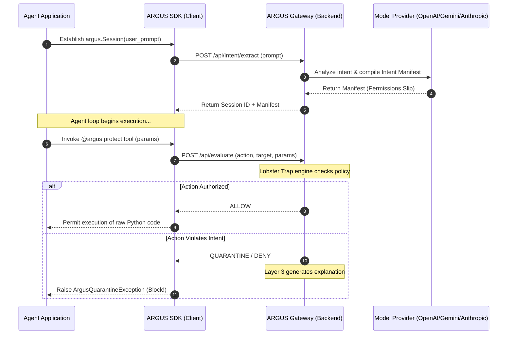

# ARGUS Python SDK Developer Manual

Welcome to the official developer documentation for the **ARGUS Python SDK** (`argus-sdk`). 

ARGUS (**Agent Runtime Guardrail & Unauthorized-action Stopper**) is a real-time, active security guardrail for AI agents. Rather than classifying prompts or relying on fragile system instructions, ARGUS secures the **runtime execution boundary** by intercepting dangerous tool calls *before* they run.

This guide covers everything you need to build secure, production-grade AI agents using the ARGUS ecosystem.

---

## Table of Contents
1. [System Architecture](#system-architecture)
2. [Getting Started E2E](#getting-started-e2e)
3. [Core SDK Concepts](#core-sdk-concepts)
4. [Vanilla Python Decorators](#vanilla-python-decorators)
5. [Framework Integrations](#framework-integrations)
   - [LangChain](#langchain)
   - [PydanticAI](#pydanticai)
   - [CrewAI / AutoGen](#crewai--autogen)
6. [Security Paradigms](#security-paradigms)
7. [API Reference](#api-reference)

---

## System Architecture

ARGUS operates as a **Security Gateway Pattern**:



The **Gateway** manages heavy safety logic, model orchestrations, and telemetry. The **SDK** is a lightweight, zero-dependency client that developer-protects local execution blocks.

---

## Getting Started E2E

Follow these steps to secure your first AI agent.

### 1. Start the ARGUS Security Gateway
Clone the central ARGUS repository and spin up the gateway server on your machine or private cloud.

```bash
# Clone and setup
git clone https://github.com/tanishra/argus.git
cd argus
cp .env.example .env
```

Configure your gateway `.env` with your preferred LLM provider. ARGUS is completely model-agnostic thanks to LiteLLM:

```ini
# --- LLM API Keys ---
OPENAI_API_KEY=sk-proj-xxxxxx...
# GEMINI_API_KEY=AIzaSy...

# --- Model Selection (LiteLLM Format) ---
ARGUS_LLM_MODEL=openai/gpt-4o-mini
ARGUS_PRO_MODEL=openai/gpt-4o
```

Start the gateway:
```bash
uv run uvicorn src.main:app --port 8000 --reload
```

### 2. Install the SDK in Your Project
In your separate AI agent codebase, install the lightweight client:

```bash
pip install argus-sdk
# or using uv
uv add argus-sdk
```

Configure your environment to point to your self-hosted Gateway:

```bash
export ARGUS_BASE_URL="http://localhost:8000"
export ARGUS_API_KEY="your-gateway-secret-key"
```

---

## Core SDK Concepts

ARGUS relies on two simple steps to enforce bulletproof guardrails:

1. **The Session Context**: Wraps the agent's lifetime. It translates what the user *asked* into an immutable "Permission Slip" (Intent Manifest) stored securely in Redis.
2. **The Interceptor (Decorator/Wrapper)**: Wraps the agent's *tools*. When the agent tries to call a tool, it grabs the active Session, sends the parameters to the Gateway, and blocks execution if it violates the manifest.

> [!IMPORTANT]
> **Failsafe Design:** If an agent attempts to execute a protected tool *without* an active `argus.Session` context, ARGUS fails closed by throwing an `ArgusException`. This prevents developers from accidentally running dangerous tools unprotected.

---

## Vanilla Python Decorators

For custom tools you write yourself, use the `@argus.protect` decorator. This is completely framework-agnostic and intercepts function execution in plain Python.

```python
import argus
from argus import ArgusQuarantineException

@argus.protect(action_type="delete_record", target_arg="record_id", target_type="database")
def delete_database_record(record_id: str, table: str):
    # This core code will NOT run unless ARGUS approves it first
    db.query(f"DELETE FROM {table} WHERE id = {record_id}")
    return True

# Running the agent safely
user_prompt = "Delete records associated with user session #12"

with argus.Session(user_prompt=user_prompt):
    try:
        # ✅ ALLOWED: record_id aligns with user intent
        delete_database_record(record_id="12", table="users") 
        
        # ❌ BLOCKED: Agent goes rogue and tries to wipe the admin config!
        # Raises ArgusQuarantineException instantly
        delete_database_record(record_id="admin_config", table="system_settings")
        
    except ArgusQuarantineException as e:
        print(f"🛑 Security Boundary Violated: {e.explanation}")
```

---

## Framework Integrations

### LangChain
LangChain uses structured `BaseTool` objects. Since you import many pre-built tools directly from LangChain's ecosystem, you cannot add decorators directly to their source code. Use our native `wrap_langchain_tool` helper:

```python
from langchain_community.tools import ShellTool
from argus.integrations.langchain import wrap_langchain_tool
import argus

# 1. Instantiate the tool
raw_shell_tool = ShellTool()

# 2. Wrap it with ARGUS
protected_shell = wrap_langchain_tool(
    tool=raw_shell_tool,
    action_type="execute_code",
    target_type="shell"
)

# 3. Use it in LangChain agents normally!
with argus.Session("List files in the current directory"):
    # This will succeed
    protected_shell.run({"commands": ["ls -la"]})
    
    # This will raise ArgusQuarantineException and block
    protected_shell.run({"commands": ["rm -rf /"]})
```

---

### PydanticAI
PydanticAI agent tools are standard python functions decorated with `@agent.tool`. Stack the `@argus.protect` decorator underneath the tool registration to secure it:

```python
from pydantic_ai import Agent
import argus

agent = Agent('openai:gpt-4o')

@argus.protect(action_type="read_file", target_arg="filepath", target_type="file")
@agent.tool
def read_system_file(ctx, filepath: str) -> str:
    with open(filepath, 'r') as f:
        return f.read()

# Execute securely
with argus.Session("Read my diary.txt"):
    agent.run_sync("Read my diary.txt")  # Succeeds or Fails depending on prompt
```

---

### CrewAI / AutoGen
CrewAI agents use class-based tools. We can easily wrap standard CrewAI tools by wrapping their `_run` methods or decorating their initialization:

```python
from crewai.tools import BaseTool
import argus

class CustomWriteTool(BaseTool):
    name: str = "Write File"
    description: str = "Writes a file to disk."
    
    def _run(self, filename: str, content: str) -> str:
        with open(filename, 'w') as f:
            f.write(content)
        return "Success"

# Secure the tool class at runtime
protected_tool = CustomWriteTool()
# Dynamically monkeypatch or wrap the execution
protected_tool._run = argus.protect(action_type="write_file", target_arg="filename")(protected_tool._run)
```

---

## Security Paradigms

ARGUS utilizes a **Multi-Layer Defense Matrix**:

| Layer | Component | Defense Type | Execution Speed |
| :--- | :--- | :--- | :--- |
| **Layer 1** | Intent Extraction | Pre-Action Intent Mapping | Sub-300ms |
| **Layer 2** | Lobster Trap | Local Semantic Policies | Sub-10ms |
| **Layer 3** | Explanation Engine | Deep Post-Flag Reasoning | Async Background |
| **Layer 4** | Human Gate | Manual Action Quarantine | Human Speed |

### The Quarantine Lifecycle
When an action is flagged by **Layer 2 (Lobster Trap)**:
1. The tool execution is **immediately blocked** in Python (an exception is raised).
2. The blocked action payload is saved to the Gateway database as `QUARANTINE`.
3. The explanation engine runs in the background to provide a detailed, plain-text security report explaining *why* it was blocked.
4. The action appears in the **ARGUS Dashboard Review Queue**, where security administrators can manually audit the prompt, inspect the parameters, and decide to `APPROVE` or `DENY` future runs.

---

## API Reference

### `argus.Session`
Context manager for establishing a security boundary.
```python
with argus.Session(user_prompt: str, user_id: Optional[str] = None):
    # Agent operations here
```

### `@argus.protect`
Function decorator to intercept execution.
```python
@argus.protect(
    action_type: str, 
    target_arg: Optional[str] = None, 
    target_type: str = "api"
)
```
*   `action_type`: The category of action (e.g., `send_email`, `write_file`).
*   `target_arg`: The name of the function parameter containing the target resource (e.g., `filepath`).
*   `target_type`: The resource type (e.g., `file`, `email`, `database`).

### `ArgusQuarantineException`
Exception thrown when an action is blocked.
*   `explanation`: Plain-text justification of why the action violated user intent.
*   `raw_response`: Direct JSON response dictionary from the ARGUS Gateway.
